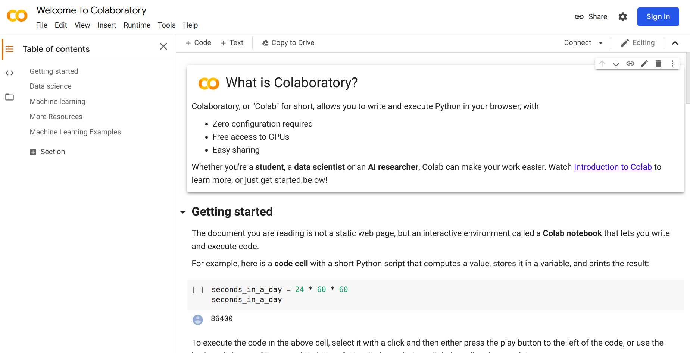
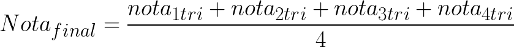
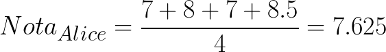

## Pocket - Introdução a análise de dados usando jupyter e pandas

Esse tutorial tem o intuito de dar uma ideia inicial sobre análise de dados para quem nunca programou e quem já programa mas ainda não conhece ou não programou em Python. 
Acontece que vejo cada vez mais pessoas se interessando por análise de dados, mas não sabe ao certo o que é, ou já faz isso muito bem em outra forma e sente a necessidade de fazer em Python porque muita gente já associa dados à Python e Jupyter. Mas acho que é importante as pessoas realmente 'provarem' do que realmente é para saber que quer continuar e se dedicar a fundo sobre o assunto. Porque às vezes pode acontecer de a pessoa aprender tudo sobre programação **só para aprender análise de dados** e vê que aquilo não é pra ela. 

Todo conhecimento eu acho mais que válido, mas eu acho interessante o aprendizado por meio de objetivos. 

Você que já se perguntou:
- O que faz um cientista de dados? 
- Por que a importância de um cientista de dados?
- Eu posso analisar dados também?

Você pode sim, e vamos começar a analisar um *dataset* que contém dados de alunos de uma turma e suas respectivas notas durante o ano letivo. E nós, como responsáveis por trazer *insights* desses dados iremos começar pelo ambiente.

Para quem já conhece o Jupyter, os dados podem ser baixados [aqui](). O tutorial foi feito utilizando ambiente virtual `venv` e no Google Colab.

----

### Objetivo

Os dados que iremos trabalhar são de alunos e suas notas em um ano escolar e o nosso objetivo é analisar os dados e responder duas perguntas:

- Considerando 7 a nota mínima para passar de ano, saber quantos alunos passaram e quantos reprovaram
- Identificar a média anual dos alunos por sexo


Vamos começar?

### Google Colab

O Google Colab é ótima opção para quem não tem o ambiente configurado, pois é prático e rápido. É da Google e você precisa apenas de uma conta do Google.

Para acessar o Google Colab clique [aqui](https://colab.research.google.com/notebooks/intro.ipynb) e aparecerá conforme a imagem abaixo. 



No menu superior da página clique `File > New notebook`. Para a criação de um notebook precisará estar logado na sua conta Google.


#### Importando bibliotecas

Para a análise de dados contamos com o apoio de bibliotecas que facilitam a nossa vida. E hoje utilizaremos duas: 
- `pandas` que nos fornece ferramentas de análise de dados com uma interface simples
-  `matplotlib` que nos permite trabalhar com a visualização de dados.

```python
import pandas as pd
import matplotlib.pyplot as plt
```

Agora vamos fazer download de um `csv` que pode ser encontrado no repositório. 

```python
url = 'https://raw.githubusercontent.com/Typekast/tutorial-jupyter-1/master/data/grades.csv'
df = pd.read_csv(url)
```

A função `read_csv` do pandas, transforma a leitura do arquivo `csv` com os dados e transforma em DataFrame na variável `df`. 


Agora vamos ter certeza se os dados vieram corretamente e são os dados do nosso contexto escolar. Com a função `.head()` você consegue visualizar as 5 primeiras linhas do DataFrame. Desta forma pode visualizar se os dados foram importados corretamente, se os dados são mesmos que os esperados e identificar as colunas.


```python
df.head()
```

Com `.columns` é possível visualizar o nome de todas as colunas existentes.

```python
df.columns
```

Utilizando o `.shape` é possível mensurar o tamanho total do DataFrame (quantidade de linhas, quantidade de colunas). Então se quisermos saber apenas a quantidade de linhas poderíamos rodar `df.shape[0]`, assim como a quantidade de colunas `df.shape[1]`.

```python
df.shape
```

Desta forma podemos identificar que os dados nos trazem `(26, 8)`, ou seja 26 alunos no total e 8 colunas.

#### Entendendo os dados

É muito importante o processo de entendimento dos dados e o contexto aplicado. Já identificamos o contexto que se trata de notas de alunos e informações como nome e idade, as notas também estão divididas por trimestres, ou seja, quatro notas durante um ano letivo. Agora vamos entender mais os dados, sua distribuição e também vamos trabalhar a visualização dos dados. Para começar é importante fazer algumas perguntas como:


**Existem nomes repetidos?**

Com o `.duplicated()` vemos se o DataFrame possui uma linha toda repetida, o que pode acontecer por variados motivos. Então é importante entender se assa duplicação faz parte ou não da análise. O resultado de `.duplicated()` retorna **True** e **False** para cada linha do DataFrame. Com o `.sum` ele soma todos os resultados **True** e retorna um valor. 

```python
df['Nome'].duplicated().sum()
```


**Existem campos vazios?**

Primeiro é importante ver se tem valores vazios com o `.isna()` que retorna `True` caso seja um campo vazio ou `False` se tiver algum valor. E com o `.sum()` podemos ver ao total de cada coluna quantos campos vazios existem.

```python
df.isna().sum()
```

#### Quantos alunas e quantos alunos tem na sala?

Podemos utilizar a função é `.value_counts()` na coluna de Sexo para contabilizar a quantidade de alunos do sexo feminino e masculino a partir de sua classificação no dataset. Esta é uma função muito útil que retorna a contagem de valores únicos excluindo valores NA por padrão.

```python
df['Sexo'].value_counts()

```

Podemos visualizar estes dados de forma simples com um gráfico de pizza a partir da contagem única utilizando o `.plot.pie()`

```python
df['Sexo'].value_counts().plot.pie()
```

ou gráfico de barras alterando o `.pie()` por `.bar()`

```python
df['Sexo'].value_counts().plot.bar()
```

#### Quantos alunos por idade?

Utilizando o `.value_counts()` podemos contabilizar quantos alunos de cada idade temos ao total na sala, podendo utilizar a visualização também

```python
df['Idade'].value_counts().plot.pie()
```


#### Qual a média dos alunos por trimestre

Nos dados temos as notas dos 4 trimestres respectivamente e para calcular a média de um conjunto de dados o **pandas** nos disponibiliza a função `.mean()`. Vamos imprimir na tela cada nota utilizando o `print()`

```python
print("Média de notas do 1 trimestre", df['Nota_1_tri'].mean())
print("Média de notas do segundo trimestre:", df['Nota_2_tri'].mean())
print("Média de notas do terceiro trimestre:", df['Nota_3_tri'].mean())
print("Média de notas do quarto trimestre:", df['Nota_4_tri'].mean())
```

Podemos visualizar essa variação de média dos semestres durante o ano, para isso primeiro criamos uma lista com o cálculo das médias.

```python
media_notas_lista = [df['Nota_1_tri'].mean(), df['Nota_2_tri'].mean(), df['Nota_3_tri'].mean(), df['Nota_4_tri'].mean()]
```

Você pode checar o que tem na lista 

```python
media_notas_lista
```

E agora vamos criar uma lista com a quantidade de trimestres para representar o eixo x

```python
trimestres = [1,2,3,4]
```

E por fim plotamos com o apoio da biblioteca do **matplotlib**, sendo que os trimestres estarão representados no eixo x e a média das notas no eixo y

```python
plt.plot(trimestres, media_notas_lista)
```

Depois dessa análise geral dos dados agora vamos para o nosso primeiro objetivo

### Objetivo 1: Quantos alunos passaram e quantos reprovaram


Os alunos tiveram 4 trimestres, e para saber a nota final é necessário fazer uma média das quatro notas:




Temos apenas as notas dos trimestre, logo será necessário a criação de uma coluna com a conta da média final. 


Vamos testar com um usuário o cálculo. Vamos escolher a primeira aluna **Alice**. Então para isso temos que encontrar ela e suas respectivas informações. Para isso precisamos primeiro localizar no DataFrame, para isso utilizaremos a função `.loc` onde especificamos que estamos buscando na coluna com os nomes dos alunos a aluna que tenha o nome igual ao descrito.

```python
df.loc[df['Nome']=="Alice"]
```

Para calcular a nota final de Alice, temos:



Como já checamos anteriormente e vimos que não tem nenhum campo vazio. Agora precisamos calcular a nota final de todos os alunos e criar uma coluna chamada `Nota_final`

```python
df['Nota_final'] = (df['Nota_1_tri'] + df['Nota_2_tri'] + df['Nota_3_tri'] + df['Nota_4_tri'])/4
```
```python
df.head()
```

Agora que a nota final foi calculada, temos que identificar quantos alunos passaram com média igual ou acima de 7. Podemos colocar o DataFrame resultante em uma variável, por exemplo, **aprovados**. E para quem não foi aprovado vamos criar um DataFrame com o resultado em **reprovados**.


```python
aprovados = df.loc[df['Nota_final'] >= 7]
reprovados = df.loc[df['Nota_final'] < 7]
```

 Para contar quantas pessoas passaram e reprovaram pode usar o `.shape` e imprimir esse resultado. Utilizaremos o `[0]` para imprimir o primeiro índice que representa a quantidade de linhas que significa cada aluno.


```python
print("Quantidade de alunos aprovados:", aprovados.shape[0])
print("Quantidade de alunos reprovados:", reprovados.shape[0])
```


### Objetivo 2: Identificar a média anual dos alunos por sexo

Agora já temos a nota final de todos os alunos, agora precisamos agrupar por sexo (Feminino e Masculino) e identificar a média de cada grupo. Para isso vamos também atribuir cada resultado de DataFrame em uma variável: **meninas** e **meninos**. Com o `.loc` estamos filtrando apenas por Sexo, sendo igual a F ou M

```python
meninas = df.loc[df['Sexo']=='F']
meninos = df.loc[df['Sexo']=='M']
```

Para imprimir a quantidade, utilizaremos o `.shape[0]` novamente

```python
print("Na turma temos", meninas.shape[0], "meninas")
print("Na turma temos", meninos.shape[0], "meninos")
```

E por fim para calcular a média anual por sexo utilizaremos o `.mean()` novamente, mas agora na coluna de nota final

```python
print("A média final das meninas é", meninas['Nota_final'].mean())
print("A média final dos meninos é", meninos['Nota_final'].mean())
```
 
E ao fim podemos concluir com os dois objetivos que foram aprovados 14 alunos e reprovados 12, ou seja quase a metade da turma reprovou. E com a nota de corte sendo 7, a média das meninas foi maior supera essa nota com `7,25` e os meninos com `6,64`.


A partir daí podemos tirar maiores insights de acordo com o contexto e a necessidade, assim como entendimento de padrões. No dataset trabalhado temos poucos dados, pois o foco é a didática e o entendimento das ferramentas.